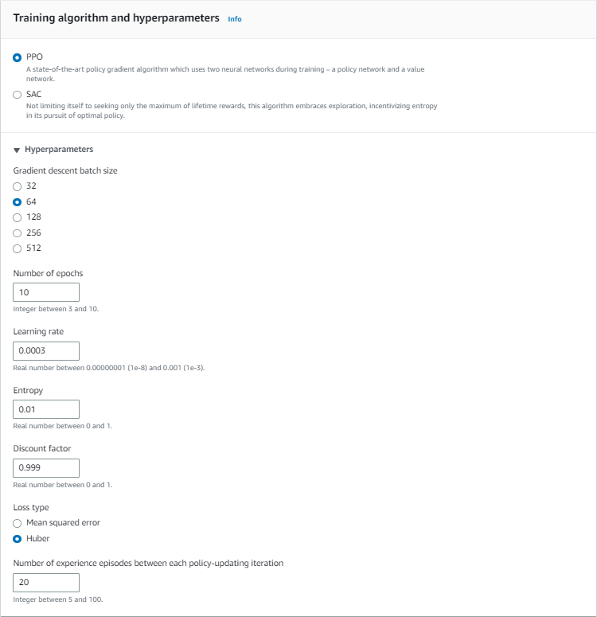
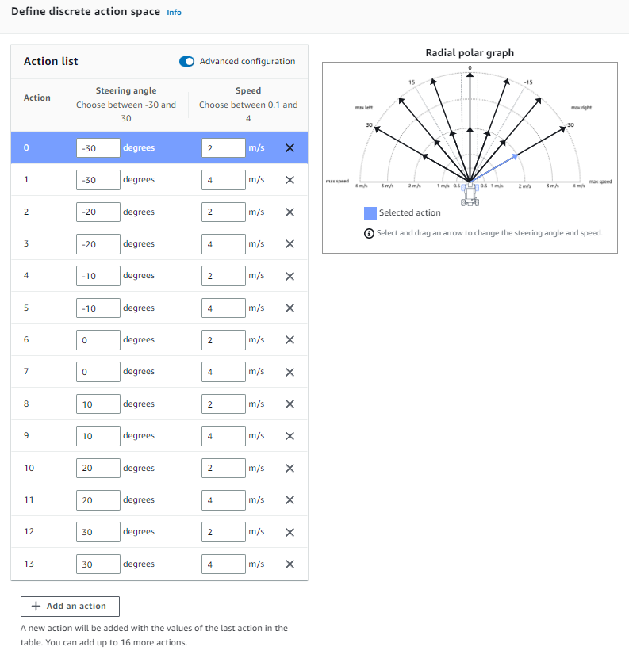

# Autonomous_Driving_Vehicle

## Reinforcement learning - Evaluation

### Training configuration  

- Race type : Time trial  
- Environment simulation : A to Z speedway - Clockwise  
- Hyperprameter  

- Action space 

### Reward graph  
